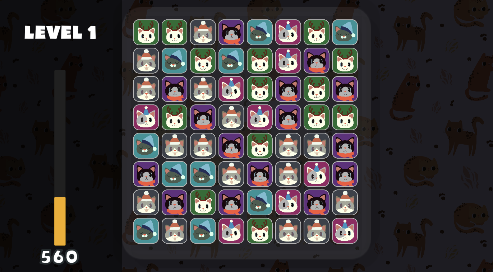
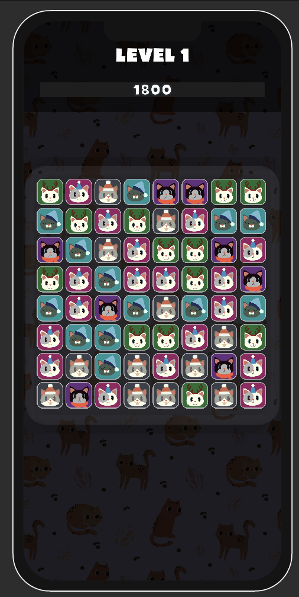
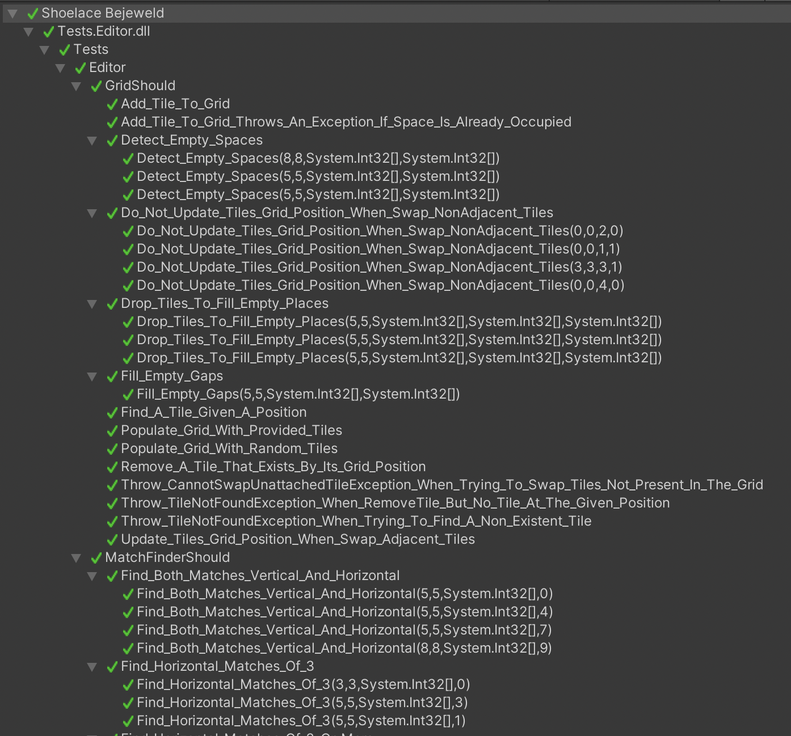

# Shoelace Bejeweld

Hey! **Thank you a lot** for playing this project. 

Please, feel free to dig into the project as much as you want. 

I will be available and happy to answer any question you have.

## Overview
1. [Game Features](#game-features)
2. [Game Platform](#game-platform)
3. [Third Parties](#third-parties)
4. [Test Coverage](#test-coverage)

## Game Features
- Swap selection
    - With Tap
    - With Drag
- Swap validation
    - Undo swap if there are no matching tiles
    - Swap successfully if tiles match
- Board generation
    - Populate with random tiles and 0-Match ensuring algorithm
    - Prebuilt board loading
- Match Finding
    - Option to replace match criteria easily by interface implementaton.
- Board Refill with random tiles
- Tile drop
- Board Lock
- Match chaining
- Levels
    - Only one level
    - Level management logic implemented and persistance
    - Level goals
- Score and Level HUD

## Game Platform

This game can be played both on Desktop (WebGL) and Mobile(Android and iOS).

</img>
</img>

## Third Parties 

These third-parties assets were included in the project:

- Sound FX: https://assetstore.unity.com/packages/audio/sound-fx/free-casual-pack-sfx-197054 
- Cat background: https://www.freepik.com/free-vector/cute-leopards-seamless-pattern_19986006.htm#query=cat%20seamless%20pattern&position=13&from_view=keyword
- Tiles graphics: Made by my lovely girlfriend :)
- Bumpo Font: https://www.dafont.com/es/search.php?q=bumpo
- NSubstitute: https://nsubstitute.github.io/

# Test coverage

The project core logic was made using Test-Driven-Development, to ensure a good architecture and prove that the code is working as expected with several test cases.

37 unit tests cover the majority of the match-3 logic.

